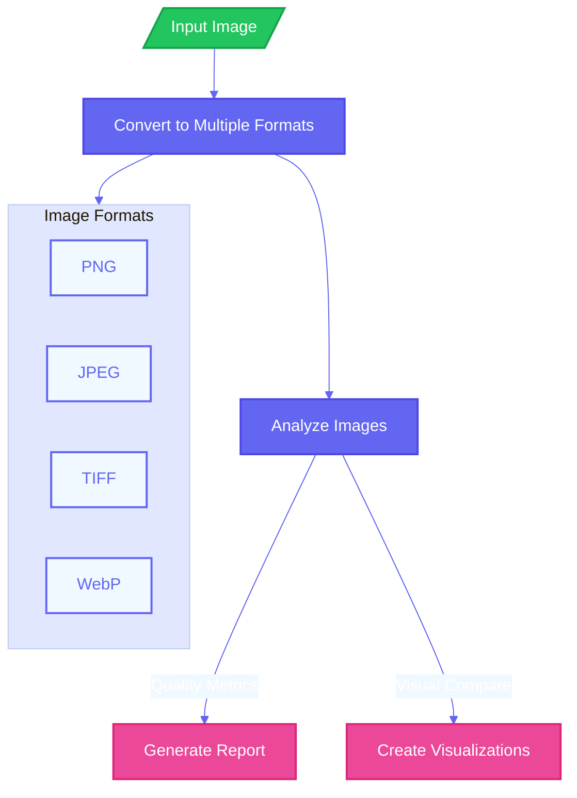

 
# Image Format Comparison Tool 🖼️

This is just a little tool for comparing different image formats. It analyzes JPEG, TIFF, WebP, and PNG formats, looking at things like how well they compress, how quickly they load, their quality, and their potential for hiding data (steganography).

## What's Coming Next? 🚀

- [ ] Working on turning this into an interactive website for easier use
- [ ] Planning to add exciting JPEG XL support for even more comparison options
- [x] Added the initial Python script
- [x] Added setup file for easy installation

## How It Works 📊

## Getting Started 🚀

1. First, clone this repository to your computer
2. Run the `setup.bat` file (compatible with Windows 10 and Python 3.11)
3. Launch the tool by typing `marimo edit` in your terminal - it'll open right in your browser!
4. Run the `test_jxl.py` file to see how it works

## License & Usage 📝

This tool is for personal use - feel free to use it for your own projects and learning! Not intended for commercial applications.

## Want to Learn More? 📚

Check out [JPEG XL](https://jpegxl.info/index.html) to learn about this exciting new image format we'll be adding soon!
